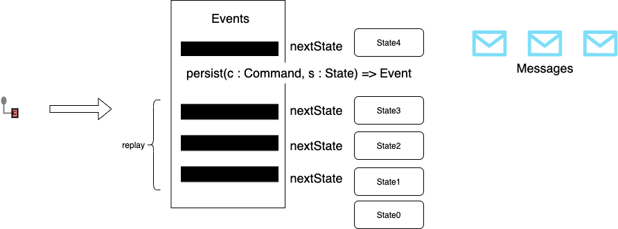

# FP State Machine

[](https://app.circleci.com/pipelines/github/ModaOperandi/sc-state-machine)

This project created to help build the event sources state machines using functional scala.

It was inspired by following:
- [John A de Goes - SCALAZ 8 VS AKKA ACTORS](https://www.youtube.com/watch?v=Eihz7kqn6mU)
- [Event Sourcing in Akka](https://doc.akka.io/docs/akka/current/typed/persistence.html#event-sourcing)

### Terminology

- Command: the message incoming to State machine *before* it hits and updates internal state. A command explicitly indicates intent, what we are trying to do. This may need to be mapped from an external message (from an upstream system) that does not make that intent explicit
- Event: message emitted as the *result of something already happened* with the state
- Message: message emitted downstream, it may be the same as Event. Messages emitted downstream are usually the Event, the latest State, or a mapped message derived from one or both.
- State: the data evolved by applying events, it has some initial state which gets updated by the events
- Total order of events: Permanently persisted total order of Events, which later may be replayed at any given time and the state may be restored. It is also very important that we can build new state machine on top existing total order of events

### How it works

 

When `Command` hits state machine, first what happening, the latest state restored from the `total order` of previous events. There is always `empty` or `initial` or `zero` state has to be provided as starting point. On the picture it is `State0`. Every event is the storage replayed against state machine starting from `State0`. 

Resulting `State3` is the latest state *before* new command was executed. At this point `state machine` has `Command` and `State3`, having these two artifacts, new `Event` may be calculated and persisted into the `total order` store. 

Lastly this latest `Event` can be applied to the `latest state State3` and new `State4` derived. As the result of this calculation new `messagas` may be emitted downstream.

### Example

Let's demonstrate the state machine on simple mathematical operations, like `+` and `-`. For detailed math examples refer to [Math](/examples/app/math)

##### Commands
- Addition 
```scala 
case class Add(v : Int) extends Command
```
- Subtraction
```scala
case class Subtract(v: Int) extends Command
```

##### Events
- Added
```scala 
case class Added(v : Int) extends Event
```
- Subtracted
```scala
case class Subtracted(v: Int) extends Event
```

##### State
```scala
case class MathState(result : Int)
```

##### State Evaluation

Now we need to describe how `MathState` gets updated by `Events` using `Cats` State Monad

```scala
def updateState(evt: Event): State[MathState, List[Event]] =
    State[MathState, List[Event]] { state =>
      evt match {
        case Added(v)      => state.copy(state.result + v) -> (evt :: Nil)
        case Subtracted(v) => state.copy(state.result - v) -> (evt :: Nil)
      }
    }
``` 

This function totally describes your domain and has to handle all possible events

##### Commands to Events, How?

There is conceptual difference between `command` and `event`. `Command` is the instruction to do something, `event` is the notification that something already happened.

We need current `state` and `command` to calculate `event`, also new `event` has to be persisted. Following function has to be provided to the state machine to calculate new event:

```scala
(Command, MathState) => F[Event]
```

##### Put it all together

Resulting state machine for the Math logic would be 

```scala
machine: Command => IO[(MathState, List[Event])] = statemachine.calcNewState[IO, Command, MathState, Event, Event](_: Command)(
        persist = persister,
        historyFetcher = _ => persister.state.get,
        initialState = () => MathState(0),
        updateState = updateState
      )
```

In this case we emit the messages the same as `Event`

This State Machine can be used in fs2 Stream and consume the stream of commands and produce new state and corresponding messages generated by applying these commands

## Support


This project is supported by YourKit with monitoring and profiling Tools. YourKit supports open source with innovative and intelligent tools for monitoring and profiling Java and .NET applications. YourKit is the creator of [YourKit Java Profiler](https://www.yourkit.com/java/profiler/), [YourKit .NET Profiler](https://www.yourkit.com/.net/profiler/), and [YourKit YouMonitor](https://www.yourkit.com/youmonitor/).

